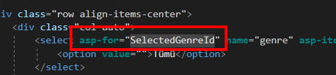

## Movie Capsule

```bash
PM> install-package Microsoft.EntityFrameworkCore -v 5.0.12
PM> install-package Microsoft.EntityFrameworkCore.SqlServer -v 5.0.12
PM> install-package Microsoft.EntityFrameworkCore.Tools -v 5.0.12
```

```json
 "ConnectionStrings": {
    "ApplicationDbContext": "server=(localdb)\\mssqllocaldb; database=MovieCapsuleDatabase;"
  },
```

**Genre.cs** ve **Movie.cs** Entity Class larımızı oluşturuyoruz.

```c#

namespace MovieCapsule.Models
{
    public class Movie
    {
        public int Id { get; set; }
        public string Title { get; set; }
        public int Year { get; set; }
        public decimal Rating { get; set; }
        public ICollection<Genre> Genres { get; set; }
    }
}
namespace MovieCapsule.Models
{
    public class Genre
    {
        public int Id { get; set; }
        public string Name { get; set; }
        public int MyProperty { get; set; }
        public ICollection<Movie> Movies { get; set; }
    }
}


```

ApplicationDbContext nesnemizi oluşturup, gerekli kısıtlamaları **FluentAPI** ile ayarlıyoruz.

```c#
 public class ApplicationDbContext : DbContext
    {
        public ApplicationDbContext(DbContextOptions<ApplicationDbContext> options) : base(options)
        {

        }
        protected override void OnModelCreating(ModelBuilder modelBuilder)
        {
            base.OnModelCreating(modelBuilder);

            modelBuilder
                .Entity<Genre>()
                .Property(x => x.Name)
                .IsRequired()
                .HasMaxLength(20);

            var adv = new Genre() { Id = 1, Name = "Adventure" };
            var act = new Genre() { Id = 2, Name = "Action" };
            var ani = new Genre() { Id = 3, Name = "Animation" };
            var bio = new Genre() { Id = 4, Name = "Biography" };
            var com = new Genre() { Id = 5, Name = "Comedy" };
            var cri = new Genre() { Id = 6, Name = "Crime" };
            var doc = new Genre() { Id = 7, Name = "Documentary" };
            var dra = new Genre() { Id = 8, Name = "Drama" };
            var fam = new Genre() { Id = 9, Name = "Family" };
            var fan = new Genre() { Id = 10, Name = "Fantasy" };
            var his = new Genre() { Id = 11, Name = "History" };
            var hor = new Genre() { Id = 12, Name = "Horror" };
            var mus = new Genre() { Id = 13, Name = "Musical" };
            var mys = new Genre() { Id = 14, Name = "Mystery" };
            var rom = new Genre() { Id = 15, Name = "Romance" };
            var sci = new Genre() { Id = 16, Name = "Sci-Fi" };
            var spo = new Genre() { Id = 17, Name = "Sport" };
            var thr = new Genre() { Id = 18, Name = "Thriller" };
            var war = new Genre() { Id = 19, Name = "War" };
            var wes = new Genre() { Id = 20, Name = "Western" };

            modelBuilder.Entity<Genre>().HasData(adv, act, ani, bio, com, cri, doc, dra, fam, fan, his, hor, mus, mys, rom, sci, spo, thr, war, wes);

            modelBuilder
                .Entity<Movie>()
                .Property(x => x.Title)
                .IsRequired()
                .HasMaxLength(250);

            modelBuilder
                .Entity<Movie>()
                .Property(x => x.Rating)
                .HasColumnType("decimal(3,1)");

            modelBuilder.Entity<Movie>().HasData(
                new Movie() { Id = 1, Title = "John Wick", Rating = 7.4m, Year = 2014 },
                new Movie() { Id = 2, Title = "The Lord of the Rings: The Fellowship of the Ring", Rating = 8.8m, Year = 2001 },
                new Movie() { Id = 3, Title = "Interstellar", Rating = 8.6m, Year = 2014 },
                new Movie() { Id = 4, Title = "Free Guy", Rating = 7.2m, Year = 2021 },
                new Movie() { Id = 5, Title = "Oldboy", Rating = 8.4m, Year = 2003 },
                new Movie() { Id = 6, Title = "Parasite", Rating = 8.6m, Year = 2019 },
                new Movie() { Id = 7, Title = "Like Stars On Earth", Rating = 8.4m, Year = 2007 },
                new Movie() { Id = 8, Title = "Arrival", Rating = 7.9m, Year = 2016, },
                new Movie() { Id = 9, Title = "Life Is Beautiful", Rating = 8.6m, Year = 1997 },
                new Movie() { Id = 10, Title = "Persona", Rating = 8.1m, Year = 1966 },
                new Movie() { Id = 11, Title = "Cars", Rating = 7.1m, Year = 2006 },
                new Movie() { Id = 12, Title = "Gone Girl", Rating = 8.1m, Year = 2014 }
                );

            // https://docs.microsoft.com/en-us/ef/core/modeling/relationships?tabs=fluent-api%2Cfluent-api-simple-key%2Csimple-key#joining-relationships-configuration
            modelBuilder
                .Entity<Genre>()
                .HasMany(x => x.Movies)
                .WithMany(x => x.Genres)
                .UsingEntity<Dictionary<string, object>>(
                    "MovieGenre",
                    x => x.HasOne<Movie>().WithMany().HasForeignKey("MovieId"),
                    x => x.HasOne<Genre>().WithMany().HasForeignKey("GenreId"),
                    x => x.HasData(
                        new { MovieId = 1, GenreId = 2 },
                        new { MovieId = 1, GenreId = 6 },
                        new { MovieId = 1, GenreId = 18 },
                        new { MovieId = 2, GenreId = 1 },
                        new { MovieId = 2, GenreId = 2 },
                        new { MovieId = 2, GenreId = 8 },
                        new { MovieId = 3, GenreId = 1 },
                        new { MovieId = 3, GenreId = 8 },
                        new { MovieId = 3, GenreId = 16 },
                        new { MovieId = 4, GenreId = 1 },
                        new { MovieId = 4, GenreId = 2 },
                        new { MovieId = 4, GenreId = 5 },
                        new { MovieId = 5, GenreId = 2 },
                        new { MovieId = 5, GenreId = 8 },
                        new { MovieId = 5, GenreId = 14 },
                        new { MovieId = 6, GenreId = 5 },
                        new { MovieId = 6, GenreId = 8 },
                        new { MovieId = 6, GenreId = 18 },
                        new { MovieId = 7, GenreId = 8 },
                        new { MovieId = 7, GenreId = 9 },
                        new { MovieId = 8, GenreId = 8 },
                        new { MovieId = 8, GenreId = 16 },
                        new { MovieId = 9, GenreId = 5 },
                        new { MovieId = 9, GenreId = 8 },
                        new { MovieId = 9, GenreId = 15 },
                        new { MovieId = 10, GenreId = 8 },
                        new { MovieId = 10, GenreId = 18 },
                        new { MovieId = 11, GenreId = 1 },
                        new { MovieId = 11, GenreId = 3 },
                        new { MovieId = 11, GenreId = 5 },
                        new { MovieId = 12, GenreId = 8 },
                        new { MovieId = 12, GenreId = 14 },
                        new { MovieId = 12, GenreId = 18 }
                        )
                );
        }
        public DbSet<Movie> Movies { get; set; }
        public DbSet<Genre> Genres { get; set; }
    }
```

**Startup.cs** içerisinde DbContext ayarlamasını yapıyoruz.

```c#
   public void ConfigureServices(IServiceCollection services)
        {
            services.AddDbContext<ApplicationDbContext>(options => options.UseSqlServer(Configuration.GetConnectionString("ApplicationDbContext")));
            services.AddControllersWithViews();
        }
```

Migration ekliyoruz ve update yapıyoruz

```bash
PM> add-migration InitialCatalogandSeed
PM> update-database
```

**HomeController.cs** içinde DbContext injection'ınını yapıyoruz ve Index actiondan Movie'leri gönderiyoruz.

```c#
private readonly ApplicationDbContext _db;
public HomeController( ApplicationDbContext db)
{
    _db = db;
}

public IActionResult Index()
{
    return View(_db.Movies.ToList());
}
```

**Index.cshtml** 

```html
@model List<Movie>
@{
    ViewData["Title"] = "Home Page";
}
<h1>Movies</h1>
<table class="table table-striped">
    <thead>
        <tr>
            <th>Id</th>
            <th>Title</th>
            <th>Year</th>
            <th>Rating</th>
            <th>Genres</th>
        </tr>
    </thead>
    <tbody>
        @foreach(Movie movie in Model)
            {
        <tr>
            <td>@movie.Id</td>
            <td>@movie.Title</td>
            <td>@movie.Year</td>
            <td>@movie.Rating</td>
            <td>@string.Join(", ", movie.Genres.Select(x => x.Name))</td>
        </tr>
            }
    </tbody>

</table>
```

*@movie.Genres* null gelecektir, LazyLoading default olarak kapalı gelmektedir.Bunu veriyi gönderirken Include() ile join işlemi yaparak getir diyebiliriz.

```c#
public IActionResult Index()
{
    return View(_db.Movies.Include(x=>x.Genres).ToList());
}
```

LazyLoading'i aktif etmek için DbContext içinde OnConfiguring metodunu override edip, aktif etmemiz gerekiyor. Veya Startup.cs içerisinde yaptığımız ayarda UseSqlServer'den hemen önce aktif etmemiz gerekiyor.

```c#
optionsBuilder.UseLazyLoadingProxies();

PM>Microsoft.EntityFrameworkCore.Proxies -v 5.0.12 //paketininde kurulu olması gerekiyor.
```

**Index.cshtml** içerisinde Genre'ye göre filtreleme işlemi yapmak istiyoruz. Bunun için Genre'larıda Index.cshml'e geçmemiz gerekiyor, bu yüzden **HomeViewModel.cs** oluşturuyoruz.

```c#
namespace MovieCapsule.Models
{
    public class HomeViewModel
    {
        public List<Movie> Movies { get; set; }
        public List<SelectListItem> Genres { get; set; }
    }
}
```

Index.cshtml içerisinde **@model HomeViewModel** ve foreach'e verdiğimiz liste kaynağınıda **Model.Movies** olarak güncellememiz gerekiyor. Ve **HomeController.cs** içindeki **Index** Action metodunu da güncelliyoruz.

```c#

public IActionResult Index()
{
    var vm = new HomeViewModel()
    {
        Genres = _db.Genres.Select(x => new SelectListItem { Text = x.Name, Value = x.Id.ToString() }).ToList(),
        Movies = _db.Movies.Include(x => x.Genres).ToList()
    };
    return View(vm);
}
```

Genre'ları SelectedListItem olarak gönderdikten sonra tek yapmamız gereken **Index.cshtml** içerisinde dropdownlist'i nerede göstermek istiyorsak

```c#
<select asp-items="Model.Genres">
    <option value="">Tümü</option>
</select>
```

kodunu eklemek.

Kodumuzu biraz daha geliştecek olursak, dropdownlist'ten herhangi bir Genre seçildiğinde sadece o Genre'ye ait filmler listelensin istiyoruz. O zaman ilk olarak seçili Genre'yi alacağız. Select'e bir *name* veriyoruz.

```html
<form>
    <div class="row align-items-center">
        <div class="col-auto">
            <select name="genre" asp-items="Model.Genres">
                <option value="">Tümü</option>
            </select>
        </div>
        <div class="col-auto">
            <button class="btn btn-primary">Listele</button>
        </div>
    </div>
</form>

```


Eğer Dropdownlist'i bir değere bağlarsak, sayfa yeniden yüklendiğinde eski değeri taşıyabiliriz. Onun için **HomeViewModel** içerisine bir *property* daha ekliyoruz.

```c#
public int? SelectedGenreId {get; set;}
```


**HomeController.cs**'de gönderdiğimiz *genre* değerini modelin içine aktarıyoruz. Yani geleni tekrar *View*'a gönderiyoruz. ***asp-for="SelectedGenreId"*** ile modele bağlıyoruz.


Eğer genre içerisinde değer yoksa false olacağından sağdaki Any() ifadesine hiç bakmayacaktır, dolayısıyla tüm listeyi döndürecektir.

